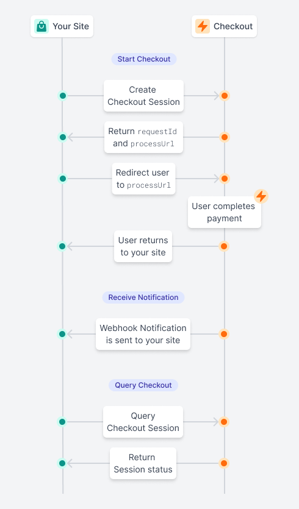

# Cómo funciona Checkout

Checkout te permite recibir pagos en línea haciendo una integración muy sencilla desde tu sitio o aplicación.

## Ciclo de vida

1. Cuando tus usuarios estén listos para completar el proceso de pago, tu aplicación debe crear una **Checkout Session**.
2. Redireccionar al usuario a la URL provista, esta URL contiene nuestro Checkout con todas sus funcionalidades listas.
3. El usuario ingresa los datos requeridos para completar el pago.
4. El usuario es redireccionado de vuelta al sitio del comercio.
5. Después de la transacción, una notificación es enviada para que la aplicación conozca el estado del pago.

Para utilizar PlacetoPay Checkout, es necesario realizar una integración de código mediante servicios HTTP, donde tu aplicación o tienda en línea redirigirá a los usuarios a Checkout para que completen el proceso de pago. A continuación, se detallan los pasos necesarios para comenzar la integración:

## Integración

En el siguiente diagrama se describe de forma visual y con más detalle el ciclo de vida de una sesión de pagos en Checkout.

### Iniciar Checkout

**Crear una sesión de pago**\
Para aceptar un pago a través de Checkout, es necesario crear una sesión de pago (**Checkout Sesssion**) utilizando el método [API - Crear sesión (CreateRequest)](../reference/WebCheckout-ES.yaml/paths/\~1api\~1session/post).\
Al llamar a este servicio, se obtendrá la URL de proceso (`processURL`) y el identificador de solicitud (`requestId`).\
Puedes ver más en el apartado [Crear Sesión](create-session.md)

**Registro del Pago en Proceso**\
En tu sistema, crear un registro que relacione el pago en proceso con el `requestID` proporcionado.\
El estado inicial de todos los pagos es pendiente (`PENDING`).

**Redirección del Usuario**\
El usuario debe ser redireccionado a la URL de proceso (`processURL`) proporcionada por PlacetoPay Checkout.

**Proceso de Pago o Suscripción**\
En la interfaz de Checkout, el usuario completará el proceso de pago o suscripción. Checkout se encargará de recopilar todos los datos necesarios.

**Redirección de vuelta al sitio del comercio**\
Una vez que el proceso de pago esté completo, el usuario puede ser redirigido de vuelta a la URL de retorno (`returnUrl`) especificada en la solicitud inicial (`CreateRequest`).

En este punto es probable que el proceso de pago haya finalizado. Para conocer el estado del pago debes esperar la notificación o consultar el estado de la sesión.

### Notificación asincrónica

Cuando una sesión tenga un estado final, PlacetoPay enviará una notificación asincrónica a tu sitio informando la finalización del proceso de pago. Asegúrate de manejar adecuadamente esta notificación para mantener la integridad de los datos.

### Consulta de sesiones

Se debe consultar las sesiones para poder completar el ciclo de vida.

**Consulta del estado de la sesión**\
Al llegar al sitio del comercio, se debe consultar el estado de la sesión.\
Esto se puede lograr utilizando el método [API - Consultar sesión (getRequestInformation)](../reference/WebCheckout-ES.yaml/paths/\~1api\~1session\~1{requestId}/post).

**Actualización y Reglas de Negocio**\
Según el estado final del pago obtenido, debes ejecutar las reglas de negocio correspondientes y actualizar la información relacionada con el pago en tu sistema.

---

Continuar Con:

- [Crear Sesión de Checkout](create-session.md)
